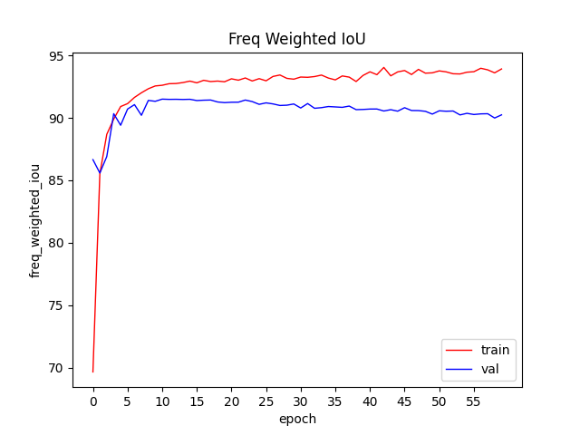
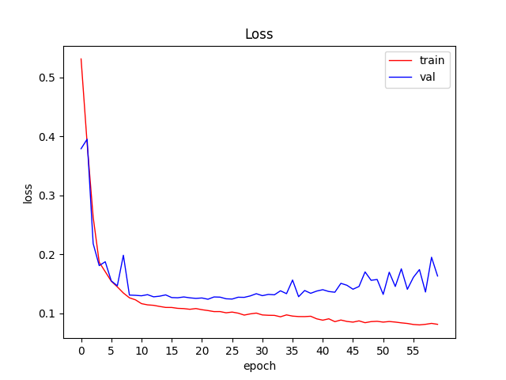
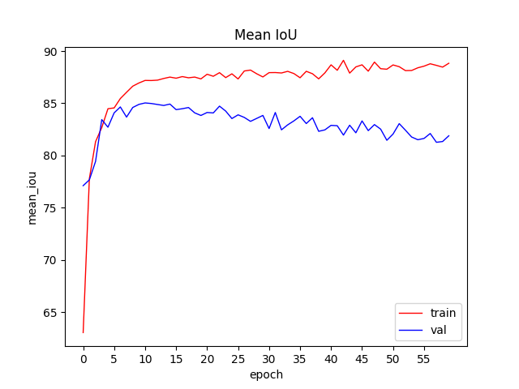
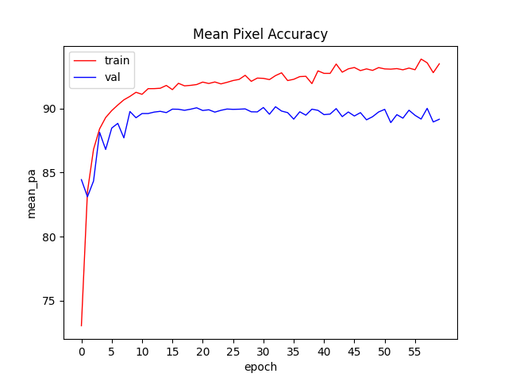
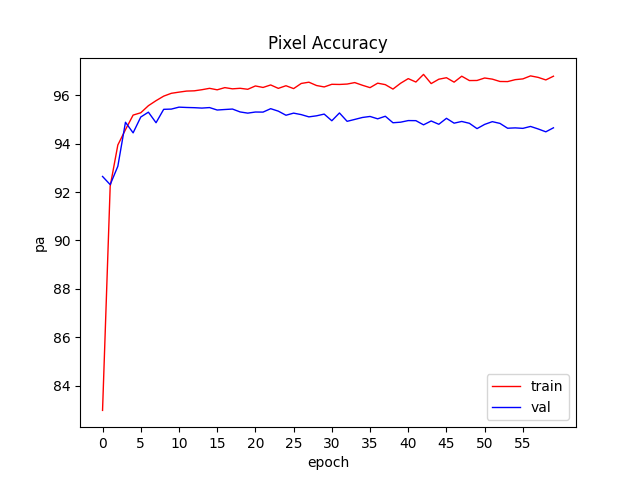

[中文](https://github.com/Phoenix8215/FCN_KITTI/blob/master/README-zh.md)
## Using FCN for road segmentation (KITTI dataset)


### Install

```shell
git clone https://github.com/Phoenix8215/FCN_KITTI  # clone
cd 
pip install -r requirements.txt  # install
```

### Instructure manual

- use`make_tsv.py`to generate the train set,validation set and test set with `tsv` format，the set of validation and testing is 80%,20% respectively.

- backbone use VGG16，loss function is binary cross entropy，training 60 epochs.
- use`python3 train.py`to train the model，and visual the process of training.







- use `python3 test.py`to predict ,outputs are stored in`output`folder.


- generated weight files which is in`ckpt`folder.

